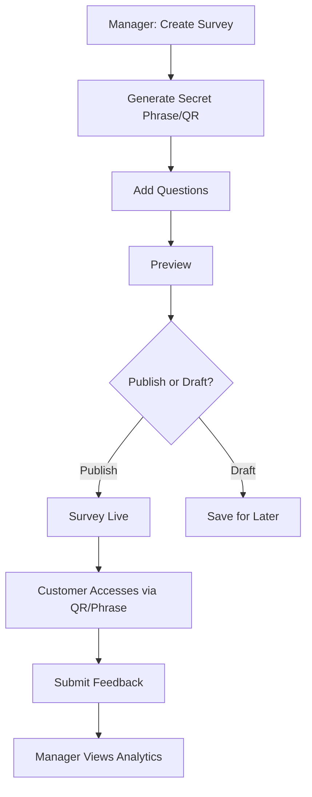

# **Feedback Collector System Documentation**
**Version 1.0**  
**Developer:** Tsegaye Abewa  
**Contact:** [abewatsegaye16@gmail.com](mailto:abewatsegaye16@gmail.com)

---

## **Table of Contents**
1. [System Overview](#system-overview)
2. [Technical Stack](#technical-stack)
3. [User Roles](#user-roles)
4. [Company Manager (Admin) Features](#company-manager-admin-features)
5. [Customer Features](#customer-features)
6. [Survey Workflow](#survey-workflow)
7. [Feedback Analytics](#feedback-analytics)
8. [Security & Access Control](#security--access-control)
9. [Deployment & Maintenance](#deployment--maintenance)
10. [Support & Troubleshooting](#support--troubleshooting)

---

## **1. System Overview**
The **Feedback Collector System** is a web-based platform designed to efficiently gather and analyze customer feedback for businesses such as hotels, supermarkets, and other customer-facing entities.

Key Features:
- **Role-based access** (Company Manager vs. Customer)
- **Survey creation & management** (Draft/Publish mode, QR code & secret phrase access)
- **Real-time feedback analytics** (Graphical reports, sentiment analysis)
- **Custom branding** (Logo, brand colors)
- **Secure access control** (Email verification, unique survey keys)

---

## **2. Technical Stack**
| Category       | Technologies Used                       |  
|---------------|-----------------------------------------|  
| **Frontend**  | React, Redux-Toolkit, Ant Design (AntD) |  
| **Backend**   | Node.js, Express.js                     |  
| **Database**  | PostgreSQL, Sequelize (ORM)             |  
| **Authentication** | JWT, Email Verification                 |  
| **Deployment** | Netlify                                 |  

---

## **3. User Roles**
### **A. Company Manager (Admin)**
- Must register and verify via email.
- Can customize company branding (logo, colors).
- Creates and manages surveys.
- Views detailed feedback analytics.

### **B. Customer**
- Accesses surveys via:
    - **Secret phrase** (provided by the company)
    - **QR code** (scannable link)
- Submits feedback anonymously or with optional identification.

---

## **4. Company Manager (Admin) Features**

### **4.1 Registration & Verification**
- Managers register with:
    - Email
    - Company details
- A **confirmation email** is sent for verification.

### **4.2 Brand Customization**
- After verification, managers can:
    - Upload a company logo.
    - Set brand colors (primary/secondary).

### **4.3 Survey Management**
#### **Creating a Survey**
1. Click **"New Survey"**
2. Enter survey details (title, description).
3. The system generates:
    - A **secret phrase** (for customer access).
    - A **QR code** (scannable link).
4. Add multiple questions (text, rating scales, multiple-choice).
5. **Preview** before publishing.
6. Choose **Publish** or save as **Draft**.

#### **Survey Status**
- **Draft**: Editable, not visible to customers.
- **Published**: Live and accessible via QR/secret phrase.

### **4.4 Feedback Analytics**
- **Dashboard includes**:
    - Weekly feedback trends.
    - Sentiment analysis (Positive/Negative/Neutral).
    - Recent submissions.
    - Graphical charts (bar, pie, line graphs).

---

## **5. Customer Features**
### **5.1 Accessing a Survey**
1. Obtain from the company:
    - **Secret phrase** (entered on the login page).
    - **QR code** (scan to open survey).
2. Submit feedback (ratings, comments).

### **5.2 Feedback Submission**
- Anonymous by default.
- Optional identification (if enabled by the company).

---

## **6. Survey Workflow**

---

## **7. Feedback Analytics**
- **Real-time updates** on dashboard.
- **Sentiment breakdown** (AI-powered analysis).

---

## **8. Security & Access Control**
- **JWT authentication** for managers.
- **Email verification** required.
- **Unique survey keys** (QR/secret phrase).
- **Rate limiting** to prevent spam.

---

## **9. Deployment & Maintenance**
### **Backend (Node/Express)**
- Environment variables for DB & API keys.
- PostgreSQL hosted on Render.

### **Frontend (React)**
- Deployed on Netlify.

### **Database Backups**
- Automated daily backups.

---

## **10. Support & Troubleshooting**
### **Common Issues**
| Issue | Solution |  
|-------|----------|  
| Can’t access survey | Verify QR/secret phrase |  
| Email not received | Check spam folder |  
| Slow dashboard | Clear cache or check server status |  

**Contact Support:**  
📧 [abewatsegaye16@gmail.com](mailto:abewatsegaye16@gmail.com)

---

